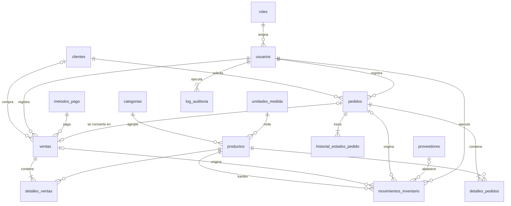

# Base de datos SIMO (SCRUM-84)

Esquema relacional consolidado en PostgreSQL (desarrollado para 18, probado en 16). Reemplaza los scripts sueltos de `backend/scripts/` e incorpora el inventario dual Bodega/Almacén.

```
db/
├── 00_init.sh              # ejecuta migraciones + seeds (lo usa Docker)
├── migrations/             # esquema, en orden; se pueden re-ejecutar sin error
│   ├── 001_base.sql            funciones compartidas, zona horaria
│   ├── 002_seguridad.sql       roles, usuarios, empresa
│   ├── 003_catalogo.sql        unidades_medida, categorias, productos
│   ├── 004_clientes_pedidos.sql clientes, pedidos, detalles, historial de estados
│   ├── 005_ventas.sql          metodos_pago, ventas, detalles_ventas
│   ├── 006_inventario.sql      proveedores, movimientos_inventario, vista v_kardex
│   └── 007_auditoria.sql       log_auditoria
├── seeds/
│   └── 001_datos_desarrollo.sql  usuarios de prueba, empresa, categorías, productos
└── tests/
    └── 001_reglas_esquema.sql    42 pruebas de reglas de negocio (no deja datos)
```

## Cómo crear la base

**Con Docker** (desde `backend/`): la primera vez que se crea el volumen, PostgreSQL ejecuta `00_init.sh` solo.

```bash
docker compose up -d --build
```

Para borrar la base y recrearla con cambios en las migraciones:

```bash
docker compose down -v && docker compose up -d --build
```

**Sin Docker (pgAdmin / psql):** crear la base `simo_retail` y ejecutar en orden los archivos de `migrations/` y luego los de `seeds/`. O bien:

```bash
POSTGRES_USER=postgres POSTGRES_DB=simo_retail sh db/00_init.sh
```

**Pruebas:**

```bash
psql -v ON_ERROR_STOP=1 -U postgres -d simo_retail -f db/tests/001_reglas_esquema.sql
```

Usuarios de prueba (seed): `admin@`, `gerente@`, `inventario@` y `vendedor@simo.local`, contraseña `Simo2026*`.

## Modelo entidad-relación



## Reglas que garantiza la base de datos

| Regla | Cómo |
|---|---|
| Stock nunca negativo (RNF-04) | `CHECK (stock_bodega >= 0)` y `CHECK (stock_almacen >= 0)` en `productos` |
| Compras solo entran a Bodega (CU-05) | `chk_movimiento_ubicaciones` en `movimientos_inventario` |
| Traslado solo Bodega → Almacén (CU-06) | `chk_movimiento_ubicaciones` |
| Ajuste manual con justificación (RF-10) | `chk_movimiento_motivo_ajuste` |
| Kardex inalterable | trigger bloquea UPDATE/DELETE/TRUNCATE en `movimientos_inventario` |
| Flujo secuencial de pedidos (RN-04) | trigger `fn_validar_transicion_pedido` |
| Fecha, hora y usuario de cada estado (RF-18) | trigger llena `historial_estados_pedido` |
| Cancelación con causa (CU-13) | `chk_historial_motivo_cancelacion` |
| Anulación con autorizador y causa (CU-11) | `chk_ventas_anulacion` |
| Un pedido genera como máximo una venta (RF-20) | `UNIQUE (ventas.id_pedido)` |
| Totales coherentes | `chk_ventas_total`, `chk_*_subtotal` |
| Log de auditoría inalterable (RF-24) | triggers + `REVOKE` en `log_auditoria` |

## Convenciones para el backend

1. **Usuario responsable.** Antes de modificar `pedidos`, dentro de la misma transacción:
   ```js
   await client.query("SELECT set_config('simo.id_usuario', $1, true)", [String(req.user.id_usuario)]);
   await client.query("SELECT set_config('simo.motivo', $1, true)", [motivo]); // al cancelar
   ```
   Si falta, la base rechaza el cambio.
2. **El stock no se edita a mano.** `stock_bodega` y `stock_almacen` cambian solo junto con una fila en `movimientos_inventario`, en la misma transacción, bloqueando el producto con `SELECT ... FOR UPDATE` (procedimientos de SCRUM-45).
3. **Deducción en cascada.** Una línea de venta o pedido genera hasta dos movimientos `SALIDA_*` (primero `ALMACEN`, luego `BODEGA`). La anulación o cancelación crea un `REVERSO_*` por cada uno, hacia la misma ubicación.
4. **Venta desde pedido.** Se inserta con `id_pedido` y **no** genera movimientos (el stock ya salió al pasar a `EN_PREPARACION`). Validar en el endpoint que el pedido esté `ENTREGADO`.
5. **Auditoría.** Ajustes, anulaciones y cancelaciones insertan en `log_auditoria` dentro de la misma transacción.
6. **Precio de compra.** No devolver `precio_compra` ni `costo_unitario` a usuarios con rol `VENDEDOR`.
7. **Tipos.** `pg` devuelve `NUMERIC` como texto (`"12.500"`): convertir en la API si el frontend espera números.
8. **Roles.** Usar `roles.codigo` (`ADMIN`, `GERENTE`, `INVENTARIO`, `VENDEDOR`) en el JWT y en `requireRole()`.
